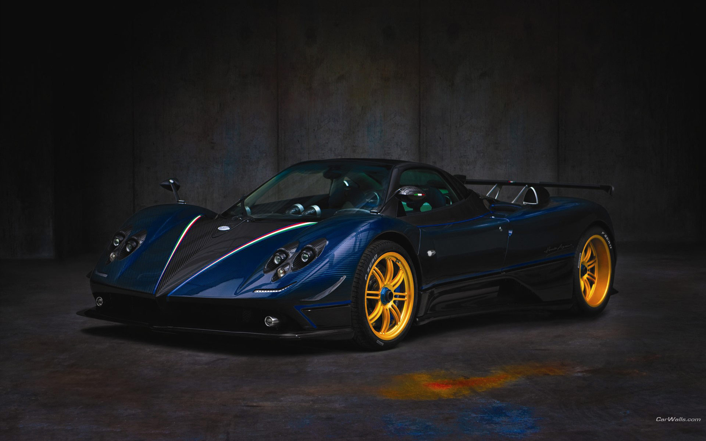

<!DOCTYPE html>

<html lang="uz">

<head>

	<title>Lazizbek.uz</title>

	<meta name="viewport" content="width=device-width, initial-scale=1.0">

	

</head>

<body>

	<header>

		<h1>Lazizbek.Uz</h1>

		<nav>

			<ul>

				<li><a href="javascript:void(0);" id="login-link">Kirish</a></li>

				<li><a href="javascript:void(0);" id="news-link">Yangilik</a></li>

				<li><a href="javascript:void(0);" id="about-link">Ma'lumot</a></li>

				<li><a href="javascript:void(0);" id="contact-link">Bog'lanish</a></li>

			</ul>

		</nav>

	</header>

	

		

			

			
Pagani Imola

		

		

			

			
Pagani Imola

		

		

			

			
Pagani Imola

		

	

	<footer>

		<h1>Kompanyalar</h1>

		<ul>

			<li><a href="https://youtube.com/@love_shortuz" target="_blank">Youtube</a></li>

			<li><a href="https://www.instagram.com/lazizbek.dev" target="_blank">Instagram</a></li>

			<li><a href="@Oxmurodov_L" target="_blank">Telegram</a></li>

			<li><a href="https://www.linkedin.com" target="_blank">LinkedIn</a></li>

		</ul>

	</footer>

	<!-- Modal (Popup) for "Kirish" -->

	

		

			&times;

			<h2>Kirish</h2>

			<form>

				

					<input type="text" placeholder="Foydalanuvchi nomi" required>

				

				

					<input type="password" placeholder="Parol" required>

				

				

					<input type="submit" value="Kirish">

				

			</form>

		

	

	<!-- Modal (Popup) for "Yangilik" -->

	

		

			&times;

			<h2>Yangiliklar</h2>

			

				Yangi web dizayn loyihalari ustida ishlash boshlandi.

				Saytning yangi interfeysi ishga tushirildi.

			

		

	

	<!-- Modal (Popup) for "Ma'lumot" -->

	

		

			&times;

			<h2>O'zim Haqimda</h2>

			

				Men Oxmurodov Lazizbek, men O'zbekistonlik web dizayner va dasturchiman. 

				Men internet texnologiyalari va dizayn sohasida o'z bilimlarimni doimiy ravishda rivojlantiraman. 

				Agar sizda biror savol bo'lsa yoki biror loyiha ustida ishlashni istasangiz, men bilan bog'lanishdan tortinmang!

			

		

	

	<!-- Modal (Popup) for "Bog'lanish" -->

	

		

			&times;

			<h2>Biz bilan bog'lanish</h2>

			
+998931685458

			<h2>Telegram</h2>

			
@Oxmurodov_L

		

	

	<!-- JavaScript -->

	

</body>

</html>
